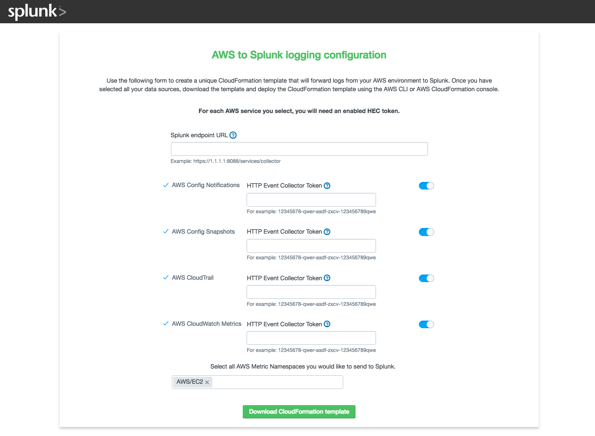

Trumpet is a tool that leverages AWS CloudFormation to set up all the AWS infrastructure needed to push AWS CloudTrail, AWS CloudWatch Metrics, and AWS Config data to Splunk using HTTP Event Collector (HEC). Once the template has been deployed, the user only needs the Splunk Add-on for AWS, Splunk Add-on for Amazon Kinesis Firehose and Splunk App for AWS installed on their Splunk instance in order to populate several of the dashboards included in the Splunk App for AWS with their data.

## To start using Trumpet
Trumpet is provided as a CloudFormation template that sets up an s3 backed static configuration site where you can customize the template to your requirements. Once configured, download the generated template and deploy it in the AWS regions you would like to collect data from.

### Deploy the CloudFormation template

Use the AWS CloudFormation console, or the following cli command. Change the stack-name value if needed.

```
$ aws cloudformation deploy --template-file aws-splunk-automation-configuration-template.json --stack-name "splunk-aws-configuration-site" --capabilities CAPABILITY_IAM
```

The template will output a url once it has completed deploying. You can find this url in the outputs tab of the AWS CloudFormation console, or by running the following AWS CLI command.

`$ aws cloudformation describe-stacks --stack-name splunk-aws-configuration-site --query 'Stacks[0].Outputs'`

Open the generated url to access the configuration site. Note: this site runs entirely local to your browser.

### Design your architecture using the configuration site



Select which AWS services you would like to collect from. For each selection, you will need to provide an enabled Splunk HTTP Event Collector Token. 

Additionally, provide the HTTP Event Collector endpoint of your Splunk environment.

After you have entered in the details about your Splunk environment, download the customized template. You can now run this template in the AWS CloudFormation console, or with the following AWS CLI command.

```
$ aws cloudformation deploy --template-file customized_splunk_aws_template.json --stack-name "splunk-aws-automation" --capabilities CAPABILITY_IAM
```

After 5-10 minutes, Splunk will begin receiving data from the configured AWS services.

## To start developing Trumpet
### Repository structure
The Trumpet project is broken up into three major parts. 
* The CloudFormation template that creates the configuration website is contained in `aws-splunk-automation-configuration`.  
* The source for the configuration website is contained in `splunk-aws-configuration-website`
* The base CloudFormation template that gets customized by the configuration website and the Lambda code used in the template is contained in `aws-splunk-automation`

### Packaging process
The three parts of the Trumpet project are dependent on each other in the following way. 

### Modifying the configuration site CloudFormation template
TODO
#### Package the template

Use the AWS CloudFormation console, or the following AWS CLI command. 

Update `{ BucketName }` in the command with an existing AWS S3 bucket. Instructions to create a new s3 bucket using the AWS CLI [here](https://docs.aws.amazon.com/cli/latest/userguide/using-s3-commands.html).
```
$ cd aws-splunk-automation-configuration
$ aws cloudformation package --template configuration_website_builder_template.json --s3-bucket { BucketName } --output-template-file template.output.json --use-json
```
#### Deploy the template

Use the AWS CloudFormation console, or the following AWS CLI command. 
```
$ aws cloudformation deploy --template-file template.output.json --stack-name "splunk-aws-configuration-site" --capabilities CAPABILITY_IAM
```

### Modifying the configuration site source
The configuration site source is contained in `splunk-aws-configuration-website/packages/src`. `splunk-aws-configuration-website.css` is the stylesheet, and `splunk-aws-configuration-website.jsx` contains the SplunkUI React code for the site.

After making any changes to the site source, run the following command to package the source into portable `.js` and `.html` files.
```
$ yarn run start:static
```
The `index.html` and `main.js` files generated by the above command should be copied into the configuration template source, and the template should be repackaged. 

### Modifying the automation CloudFormation template
TODO

#### Package the template

Using the following AWS CLI command. 

Update `{ BucketName }` in the command with an existing AWS S3 bucket. Instructions to create a new s3 bucket using the AWS CLI [here](https://docs.aws.amazon.com/cli/latest/userguide/using-s3-commands.html).
```
$ cd aws-splunk-automation
$ aws cloudformation package --template trumpet_full.json --s3-bucket { BucketName } --output-template-file template.output.json --use-json
```
#### Deploy the template
```
$ aws cloudformation deploy --template-file template.output.json --stack-name "splunk-aws-automation" --capabilities CAPABILITY_IAM
```

## Troubleshooting
TODO

## Support

Trumpet is currently maintained by [nstonesplunk](https://github.com/nstonesplunk)
