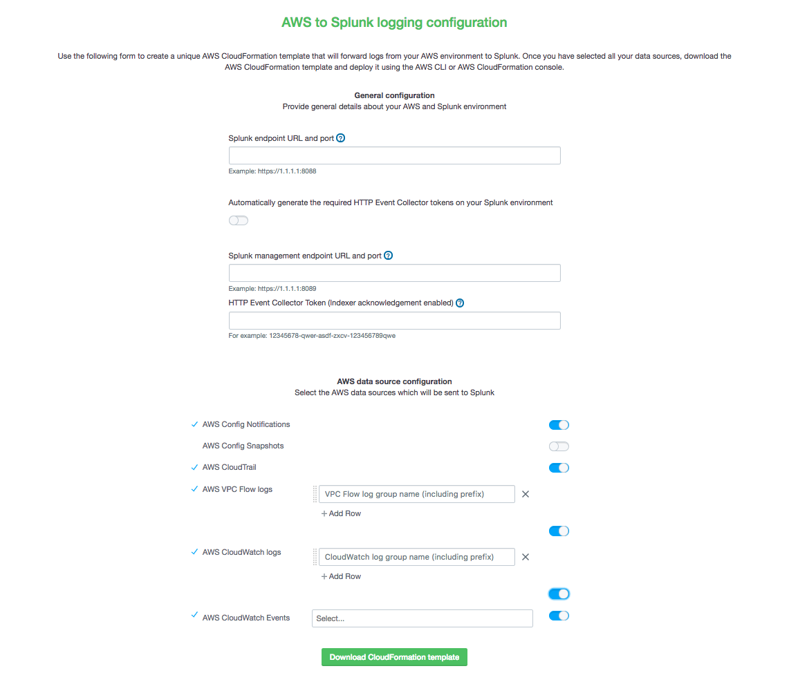

Trumpet is a tool that leverages AWS CloudFormation to set up all the AWS infrastructure needed to push AWS CloudTrail, AWS Config, and AWS GuardDuty data to Splunk using HTTP Event Collector (HEC). Once the template has been deployed, the user only needs the Splunk Add-on for AWS and Splunk App for AWS installed on their Splunk environment in order to start analyzing AWS data in Splunk.

Currently the following sourcetypes are supported by the automation templates:
* ***aws:config***
* ***aws:config:notification***
* ***aws:cloudtrail***
* ***aws:cloudwatchlogs***
    * Example: AWS Lambda logs
    * Example: custom logs
* ***aws:cloudwatchlogs:vpcflowlogs***
* ***aws:AWS service sending to CloudWatch Events:firehose***
    * Example: ***aws:guardduty:firehose***
    * Example: ***aws:macie:firehose***

## Major update:

Trumpet has been updated to support a variety of additional AWS services and now only requires a maximum of two Splunk HTTP Event Collector (HEC) tokens, one with indexer acknowledgement enabled and one without indexer acknowledgement enabled. 

In addition, there is no longer an automated HEC token creation template and manual template, the selection of manual vs automated HEC token creation is now fully encapsulated in the setup page.

**If you are visiting this repository from the Splunk blog post** - please note that the instructions in the post are currently out of date. Please follow the instructions in this README instead. (This message will be removed when the blog post is updated to reflect the most recent Trumpet update)

Due to the significance of the changes, you may want to access the old version in the v0.1 release branch.

You can find a summary of these changes in this repo's CHANGELOG.md file.

## To start using Trumpet
Trumpet is provided as an HTML webpage that can be run locally in a web browser where you can customize the downloadable CloudFormation template to your requirements. Once configured, download the generated template and deploy it in the AWS regions you would like to collect data from.

### 0. Splunk Prerequisites
Install the [Splunk App for AWS](https://splunkbase.splunk.com/app/1274/?) and the [Splunk Add-on for AWS](https://splunkbase.splunk.com/app/1876/) on the endpoint/s that will be receiving data using HTTP Event Collector.
          
### 1. Open the configuration webpage

Download `trumpet_website_source.zip` and unzip the file. 

Open the index.html file in a web browser (usually this can be done by double clicking to open the file, otherwise, left click -> select *Open with* -> select a web browser).

### 2. Choose your preferences using the configuration site



Select which AWS services you would like to collect from. You need to provide the HTTP Event Collector (HEC) endpoint of your Splunk environment, and determine if you would like to automatically generate the HEC tokens required. If you choose not to automatically generate HEC tokens in your Splunk environment, you will need to provide your manually generated, enabled Splunk HTTP Event Collector Tokens. See the `Manual Token Setup` section of this documentation.

After you have entered in the details about your Splunk environment and/or made your data collection selections, download the customized template. You can now run this template in the AWS CloudFormation console, or through the AWS CLI.

### 3. Deploy the generated custom CloudFormation template

Deploy the template in the AWS CloudFormation console.

If you prefer to use the AWS CLI, the below command will also deploy the template.
```
$ aws cloudformation deploy --template-file customized_splunk_aws_template.json --stack-name "splunk-aws-automation" --capabilities CAPABILITY_IAM
```

After 5-10 minutes, Splunk will begin receiving data from some of the configured AWS services. Do NOT delete the CloudFormation stack unless you would like to stop sending AWS data to Splunk.

### Manual token setup
Setting up the tokens required from the Splunk GUI is a straightforward process. You will need to create a pair of HEC tokens on the Splunk side (Depending on your Splunk architecture, this can be a deployment server, a Splunk instance acting as a forwarder, etc.).

If you select the aws:config sourcetype, you will need to create a HEC token with indexer acknowledgement turned off. All other sourcetypes will require a single HEC token with indexer acknowledgement turned on. Details about the specific configuration for these two tokens is detailed below.

* ***Indexer acknowledgement turned on***
    * **Name:** Enter a name of your choice
    * **Enable indexer acknowledgement:** ***checked***
    * **Source type:** `Automatic`
    * **Index:** selection should align to options described [here](https://docs.splunk.com/Documentation/AWS/5.1.1/Installation/Macros). Generally this should be `main`.
    * **App Context:** `splunk_httpinput (splunk_httpinput)`
* ***Indexer acknowledgement turned off***
    * **Name:** Enter a name of your choice
    * **Enable indexer acknowledgement:** ***unchecked***
    * **Source type:** `Auomatic`
    * **Index:** selection should align to options described [here](https://docs.splunk.com/Documentation/AWS/5.1.1/Installation/Macros). Generally this should be `main`.
    * **App Context:** `splunk_httpinput (splunk_httpinput)`

## Troubleshooting
- Check that all AWS services you wish to log, such as Config, GuardDuty, Macie, etc. are turned on. For CloudTrail, you will need to create a trail if one does not already exist.
- If you would like to ingest IAM CloudTrail AwsApiCalls, a Trumpet template with CloudTrail selected must be run in the us-east-1 region. IAM is a global service that pushes all IAM activity to CloudWatch Events ONLY to the us-east-1 region.
- Check that each HEC token is enabled and that SSL is turned on
- Check the firehose settings in AWS. The listed HEC endpoint should have a valid SSL cert installed for the HEC port. Confirm the cert is valid by visiting `https://{{ endpoint }}:8088/services/collector/health`. If you do not get a security warning, SSL using a valid cert for HEC is correctly configured. Otherwise you need to install a valid cert on the endpoint or use an AWS ELB intermediary to terminate SSL before forwarding to your HEC endpoint.
- Enable CloudWatch logs on each Kinesis Firehose Delivery stream for improved debugging
- In some cases, Trumpet will fail to deploy if AWS Config is misconfigured. Check that there are no IAM permission/S3 bucket errors with your configuration recorder before deploying.
- The aws:config sourcetype is populated by AWS Config snapshots. To check available delivery channels and snapshot delivery frequency settings run the below command.
```
$ aws configservice describe-delivery-channels
```
- Config snapshot delivery settings can be modified using the `put-delivery-channel` AWS CLI command. Instructions [here](https://docs.aws.amazon.com/cli/latest/reference/configservice/put-delivery-channel.html).
- For aws:config run the below command to manually deliver a snapshot (you may need to change the delivery channel name)
```
$ aws configservice deliver-config-snapshot --delivery-channel-name default
```
- Check CloudWatch logs for malfunctioning Lambdas.
- If the `aws:config:notification` sourcetype is not being ingested as expected, check that the AWS Config recorder is turned on. The recorder should be turned on by the template, however if there is an existing recorder that is turned off when the template runs, the recorder will need to be turned on manually from the AWS Console or using the AWS CLI.
- `{VPC OR CML}FlowLogSubscriptionFilter{LOG GROUP NAME} Resource limit exceeded.`
    - This error means one of the provided log groups already has a subscription filter attached. CloudWatch log groups have a limit of (1) subscription filter, so the existing subscription filter must be removed, or the log group must be duplicated.
- In progress...

## Hosting Trumpet

There are a number of options for users wanting to host Trumpet.

The Trumpet tool can be run as a Splunk app, with similar steps to those described in the above, except that *Step 1. Open the configuration webpage* will be replaced with installing and opening the Splunk app in the trumpet.spl file contained in this repository.

The Trumpet tool can also be run as an s3 backed hosted website. Deployment of this website can be automated using the following depployment steps.

Download `trumpet_website_template.json` and launch the stack in the AWS CloudFormation console. 

If you prefer to use the AWS CLI to deploy, download the template and launch the stack using the following CLI command. Change the stack-name value if needed.
```
$ aws cloudformation deploy --template-file trumpet_website_template.json --stack-name "splunk-aws-configuration-site" --capabilities CAPABILITY_IAM
```

The template will output a url linking to a one-time Splunk configuration website once it has completed deployment. You can find this url in the outputs tab of the AWS CloudFormation console, or by running the following AWS CLI command.
```
$ aws cloudformation describe-stacks --stack-name splunk-aws-configuration-site --query 'Stacks[0].Outputs'
```

Open the generated url to access the configuration site. Note that this site runs entirely local to your browser.

## Support

Trumpet is currently maintained by [nstonesplunk](https://github.com/nstonesplunk). This is not a Splunk supported solution.
