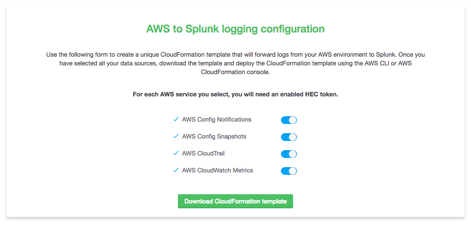

Trumpet is a tool that leverages AWS CloudFormation to set up all the AWS infrastructure needed to push AWS CloudTrail, AWS CloudWatch Metrics, and AWS Config data to Splunk using HTTP Event Collector (HEC). Once the template has been deployed, the user only needs the Splunk Add-on for AWS, Splunk Add-on for Amazon Kinesis Firehose and Splunk App for AWS installed on their Splunk instance in order to populate several of the dashboards included in the Splunk App for AWS with their data.



## To start using Trumpet
Trumpet is provided as a CloudFormation template that sets up an s3 backed static configuration site where you can customize the template to your requirements. Once configured, download the generated template and deploy it in the AWS regions you would like to collect data from.

### Deploy the CloudFormation template

Use the AWS CloudFormation console, or the following cli command. Change the stack-name value if needed.

```
$ aws cloudformation deploy --template-file aws-splunk-automation-configuration-template.json --stack-name "splunk-aws-configuration-site" --capabilities CAPABILITY_IAM
```

### Configure your architecture with the configuration site


## To start developing Trumpet
### Repository structure
The Trumpet project is broken up into three major parts. 
* The CloudFormation template that creates the configuration website is contained in `aws-splunk-automation-configuration`.  
* The source for the configuration website is contained in `splunk-configuration-website`
* The base CloudFormation template that gets customized by the configuration website and the Lambda code used in the template is contained in `aws-splunk-automation`

### Modifying the configuration site CloudFormation template
#### Package the template

Use the AWS CloudFormation console, or the following AWS CLI command. 

Update `{ BucketName }` in the command with an existing bucket. Instructions to create a new s3 bucket using the AWS CLI [here](https://docs.aws.amazon.com/cli/latest/userguide/using-s3-commands.html).
```
$ cd aws-splunk-automation-configuration
$ aws cloudformation package --template cf_website_builder_test/website_builder_lambda.json --s3-bucket { BucketName } --output-template-file template.output.json --use-json
```
#### Deploy the template
```
$ aws cloudformation deploy --template-file template.output.json --stack-name "splunk-aws-configuration-site" --capabilities CAPABILITY_IAM
```

### Modifying the automation CloudFormation template
#### Package the template

Use the AWS CloudFormation console, or the following AWS CLI command. 

Update `{ BucketName }` in the command with an existing AWS S3 bucket. Instructions to create a new s3 bucket using the AWS CLI [here](https://docs.aws.amazon.com/cli/latest/userguide/using-s3-commands.html).
```
# cd aws-splunk-automation
$ aws cloudformation package --template trumpet_full.json --s3-bucket { BucketName } --output-template-file template.output.json --use-json
```
#### Deploy the template
```
$ aws cloudformation deploy --template-file template.output.json --stack-name "splunk-aws-automation" --capabilities CAPABILITY_IAM
```

## Support

Trumpet is currently maintained by [nstonesplunk](https://github.com/nstonesplunk)
